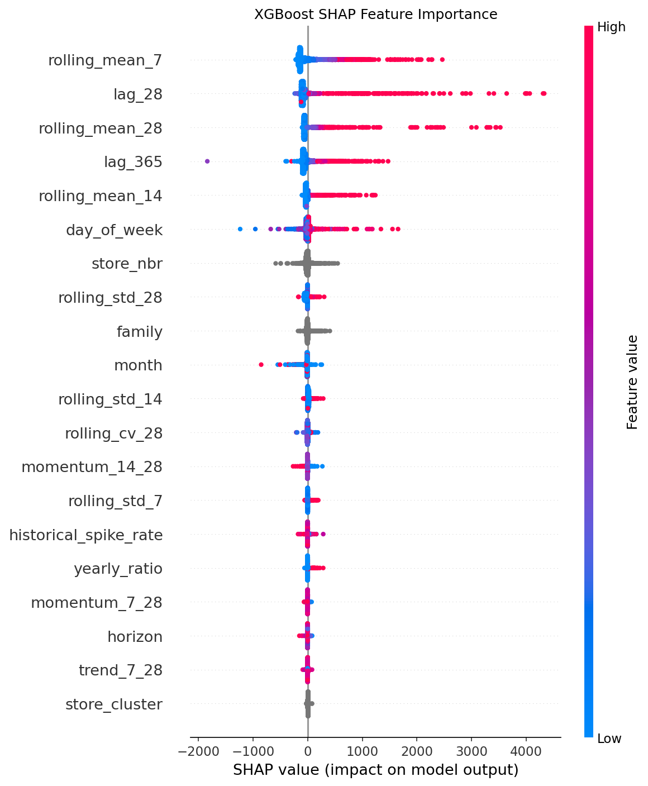

🌐 [فارسی / Persian](README.fa.md)
# Favorita Store Sales Forecasting

Multi-horizon retail demand forecasting for Corporación Favorita (Ecuador) — built as an end-to-end case study in diagnosing *why* a forecasting model fails on specific segments, not just in building one that scores well on average.

## The Business Problem

Retailers need accurate demand forecasts to plan inventory, staffing, and promotions. A model that is accurate *on average* can still be dangerously wrong for the subset of days that matter most operationally — large-volume sales spikes, where under-forecasting means stockouts and lost revenue.

This project forecasts daily sales, 1 to 15 days ahead, for every store–product-family combination in the Favorita chain, using a direct multi-horizon XGBoost model. The focus of the analysis is not just "build a model," but **finding, explaining, and quantifying where and why the model is least reliable** — and building a mechanism to flag that unreliability automatically.

## Key Results

- **Overall validation WAPE: 12.44%** (MAE 59.2, RMSE 211.7) across a 15-day forecast horizon, evaluated on four held-out origins.
- **64% lower error than a naive persistence baseline** (34.22% WAPE) and **27% lower error than a weekly-seasonal-naive baseline** (16.99% WAPE) — see the table below.
- **High-confidence predictions (67% of tail volume) achieve a WAPE of 10.46%** and a severe-underprediction rate of just **0.42%**.
- **Low-confidence predictions carry a severe-underprediction rate of 15.22%** — 36x higher than high-confidence predictions — identified automatically by a post-hoc reliability layer (see below), without changing the model itself.
- Diagnosed that large sales spikes are concentrated in specific store/family combinations (mainly `CLEANING`, store type `C`) and ruled out promotions as the cause through targeted hypothesis testing.

### Baseline Comparison

| Model | Average WAPE (across 3 forecast origins, 15-day horizon) |
|---|---|
| Naive (persistence) | 34.22% |
| Weekly Seasonal Naive | 16.99% |
| **XGBoost (this project)** | **12.44%** |

The weekly-seasonal baseline (last observed value for the same day of week) is already a reasonably strong baseline for retail data, since it captures weekly demand cycles. The XGBoost model still cuts its error by more than a quarter, primarily by learning cross-series patterns (store, family, cluster) and longer-term trend/volatility signals that a per-series seasonal lookup cannot capture.

## Approach

### 1. Exploratory Data Analysis
Sales distribution, trend, and seasonality (yearly / monthly / weekly) were analyzed to understand the demand patterns before any modeling decision was made.

### 2. Feature Engineering
- **Calendar features**: day of week, month, national/regional/local holidays, Black Friday, Cyber Monday, Mother's Day (mapped correctly by locale to avoid leaking store-irrelevant holidays).
- **Historical demand features**: lags (7/14/28/365 days) and rolling means (7/14/28 days), all leakage-safe (`shift(1)` before rolling).
- **Volatility features** (added after diagnosing the spike problem — see below): rolling standard deviation and a coefficient-of-variation feature (`rolling_cv_28`) that captures how volatile a series is, independent of its sales level.
- **Historical spike-rate feature**: how often a given store–family series has produced an outlier day in its own history, computed with a leakage-safe expanding window.

### 3. Direct Multi-Horizon Forecasting
Rather than a single one-step model iterated forward, a **separate direct-forecast dataset is built for each horizon (1 to 15 days)**, each with horizon-appropriate lag features. This avoids compounding forecast errors across the horizon.

### 4. Model
XGBoost (`reg:squarederror`, 1000 trees, early stopping) with native categorical feature support (`store_nbr`, `family`, `store_type`, `city`, `state`, `store_cluster`).

### 5. Validation Strategy
Evaluated across **four forecast origins** spanning June–July 2017. One origin (`2017-07-10`) was deliberately **held out from all feature-engineering and threshold decisions** and only inspected once, at the end, as a final generalization check — to guard against unintentionally overfitting design choices to the validation set.

## The Spike Problem: A Diagnostic Case Study

Initial validation showed the model performing well overall but underpredicting a small subset of large-volume days (~1.3% of high-volume rows had predictions less than half the actual value). Rather than immediately tuning hyperparameters, the investigation followed a structured diagnostic path:

1. **Ruled out promotions** — severe-underprediction rows and well-predicted rows had nearly identical promotion rates (98.4% vs 96.0%), so `onpromotion` was not the missing signal.
2. **Found concentration by segment** — 44–56% of severe cases fell in the `CLEANING` family (vs. ~13% of the well-predicted population), and store type `C` was similarly over-represented.
3. **Found an information gap** — severely underpredicted rows had systematically *lower* historical lag/rolling-mean values than well-predicted rows, meaning the spike was genuinely not visible in the features available at prediction time for those specific rows.
4. **Added volatility features** (`rolling_std_*`, `rolling_cv_28`) to give the model a way to recognize *inherently volatile* series, even when their recent average looked unremarkable.
5. **Validated with SHAP** — confirmed the new volatility feature carries real signal (severe cases show 76% higher `rolling_cv_28` than well-predicted cases) even though the model's built-in feature-importance ranking under-weights it relative to level-based features (`lag_28`, `rolling_mean_*`).

This is a deliberate finding, not a limitation glossed over: **the model's objective function (squared error) has little incentive to fit a rare, high-variance subset of the data well**, even when the model has features that could help. Rather than force-fitting this with an aggressive re-weighting scheme (which risks overfitting to ~120 rows), the project instead built a way to **flag** these cases explicitly.

## Prediction Confidence Layer

Every prediction is tagged `high` / `medium` / `low` confidence based on the tercile of the series' own `rolling_cv_28` (volatility) in the validation set — a fully data-driven threshold, not an arbitrary cutoff. This is validated, not just asserted:

| Confidence Tier | WAPE | Severe Underprediction Rate |
|---|---|---|
| High | 10.46% | 0.42% |
| Medium | 14.31% | 1.88% |
| Low | 40.18% | 15.22% |

This turns a known model weakness into an actionable signal: a downstream planning process can treat `low`-confidence forecasts differently (e.g. wider safety stock, manual review) instead of trusting every number equally.

## Model Interpretation

Feature importance (gain-based) and SHAP values both confirm the model relies primarily on recent demand level (`lag_28`, `rolling_mean_7/14/28`, `lag_365`) — consistent with a squared-error objective optimizing for the bulk of the data rather than rare tail events.



## Limitations

- The model underpredicts roughly 1.1% of high-volume (>1000 units) days by more than 50%, concentrated in a small number of store–family series with inherently volatile demand histories.
- This is treated as a **known, quantified, and flagged** limitation (via the confidence layer above) rather than an unaddressed gap — a deliberate choice over chasing diminishing-return fixes (aggressive re-weighting or unconstrained hyperparameter search) that risk overfitting to a few hundred rows.

## Project Structure

```
Favorita Store Sales Forecasting/
├── src/
│   └── Favorita_GlobalModel.py   # Full pipeline: EDA → features → model → diagnostics
├── data/                          # Raw Kaggle data (not tracked in git)
├── notebooks/                     # (reserved for exploratory notebooks)
├── assets/                        # Images used in this README
├── requirements.txt
└── README.md
```

## Data Source

[Store Sales - Time Series Forecasting (Kaggle)](https://www.kaggle.com/c/store-sales-time-series-forecasting) — daily sales data for Corporación Favorita, an Ecuador-based grocery retailer, including store metadata, oil prices, holidays, and promotions.

## How to Run

```bash
pip install -r requirements.txt
```

Place the Kaggle CSV files in `data/`, then run:

```bash
python src/Favorita_GlobalModel.py
```

By default, model artifacts (trained model, processed datasets, predictions) are saved to `outputs/<run_tag>/` inside the project — no configuration needed. To redirect large artifacts elsewhere (e.g. to avoid cloud-sync storage limits), set the `FAVORITA_OUTPUT_DIR` environment variable once; the script falls back to the in-project default automatically if it's not set.

## Tech Stack

Python · pandas · NumPy · XGBoost · SHAP · scikit-learn (metrics) · matplotlib
